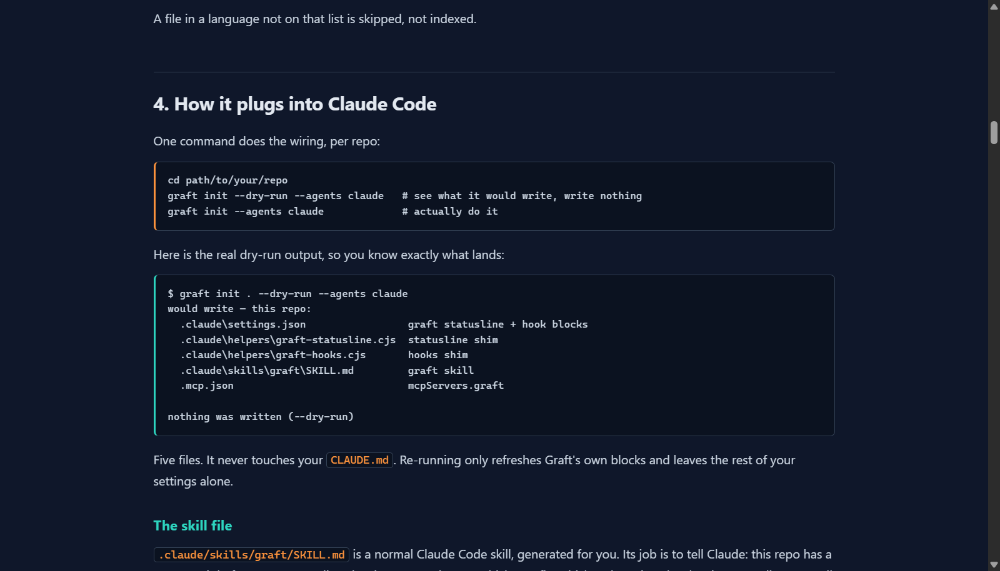
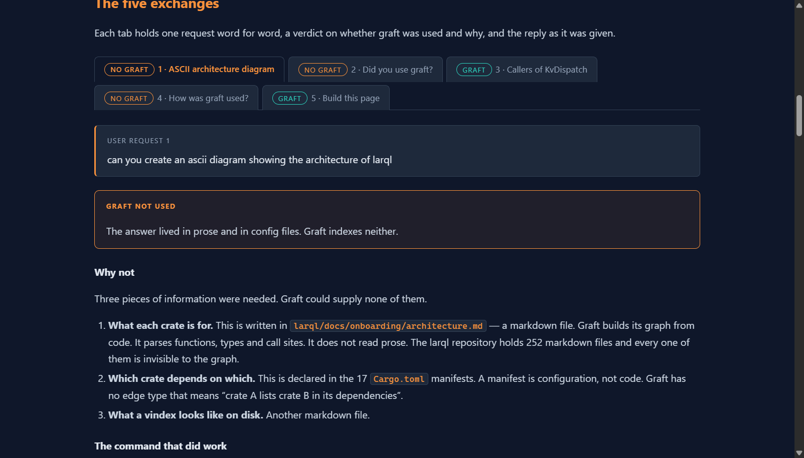

# Graft in practice

**A hands-on evaluation of [Graft](https://github.com/trailhq/Graft), a code-graph
retrieval tool for AI coding agents.**

Two write-ups, both built from real command output captured during live sessions.
Nothing here is invented or paraphrased from documentation.

| Page | What it is |
| --- | --- |
| **[Graft, and how to actually use it in Claude Code](https://az9713.github.io/graft-in-practice/graft-guide.html)** | The reference guide. What Graft builds, how it works, how it plugs into Claude Code, ~10 worked examples, 6 gotchas, and the vendor benchmarks labelled as vendor-measured. |
| **[Graft in practice](https://az9713.github.io/graft-in-practice/graft-in-practice.html)** | The session log. Five requests against one real Rust codebase — three needed no code index at all, two did. Every request and reply verbatim, with a verdict on why. |

---

## The guide

[](https://az9713.github.io/graft-in-practice/graft-guide.html)

<p align="center"><a href="https://az9713.github.io/graft-in-practice/graft-guide.html"><b>Open the live page &rarr;</b></a></p>

Graft builds a map of your codebase once and hands it to your coding agent, so the
agent stops re-exploring the same repository on every task. This page says what it
is, what it does under the hood, and gives worked examples you can copy.

## The session log

[](https://az9713.github.io/graft-in-practice/graft-in-practice.html)

<p align="center"><a href="https://az9713.github.io/graft-in-practice/graft-in-practice.html"><b>Open the live page &rarr;</b></a></p>

Five tabbed exchanges. Each one holds the request word for word, a verdict on
whether Graft was used and why, and the reply as it was given.

| Request | Verdict | Why |
| --- | --- | --- |
| ASCII architecture diagram | no graft | Crate roles were in Markdown; dependency arrows were in `Cargo.toml`. Both invisible to the index. |
| "Did you use graft?" | no graft | A question about the transcript, not about the code. |
| "List all the callers of `KvDispatch`" | **graft, 23 calls** | Names a symbol, asks for its edges. Answered with zero source files opened. |
| "Explain how graft was used" | no graft | The transcript again. |
| "Build this page" | **graft, 1 call** | `graft map`, run only to test a claim the page makes. |

---

## What this evaluation found

**The one rule that decides everything: Graft indexes code, not prose or
configuration.** Markdown files, README files and `Cargo.toml` manifests are
invisible to the graph. In the test repository that is 252 Markdown files and 17
manifests — and it happens to be where the architecture is written down.

So the question to ask is not "is this about the codebase?" It is **"does the
answer live in the code, or in the words about the code?"**

Five further findings, each traced to a real command in the pages above:

1. **A failed Graft command can be the most useful one.** `graft callers KvDispatch`
   returned no callers, but classified the symbol as an *interface*. That one word
   reshaped the whole answer, because a trait has implementors and method call
   sites rather than callers.
2. **Use symbol names with `callers`, not regular expressions with `grep`.** Three
   regex searches returned nothing on names that `callers` resolved immediately.
3. **`graft grep` takes a regex, so punctuation bites.** A leading `+` is a syntax
   error, not a search term.
4. **Text hits are not call sites.** Of 102 hits for one symbol, most were doc
   comments and re-export lines. The graph finds the text; a person still decides
   what it means.
5. **Graft reports its own blind spots.** It warned that two functions shared a
   name and that it drops ambiguous edges rather than guessing.

### On the token-savings numbers

Graft prints a savings banner after every command. Those banners are real but they
compare against the worst possible alternative — reading every file the command
touched, whole. Nobody would do that. One `graft map` call claimed 4,301,987 tokens
saved, measured against reading all 1,482 files in the repository.

The defensible claim is narrower and still worth having: the `KvDispatch` question
was answered from 23 index queries with **zero source files opened**. Reading the 30
files that mention that symbol would have cost roughly 178,000 tokens. That
comparison is real, because reading those 30 files was the actual alternative.

---

## Sources and credits

**The tool under evaluation — Graft**
- Repository: [github.com/trailhq/Graft](https://github.com/trailhq/Graft)
- npm package: [`@nanonets/graft`](https://www.npmjs.com/package/@nanonets/graft) —
  note that the npm name and the GitHub name differ
- Version evaluated: 0.16.0

**The video that started this**
- **[Github Top Trending Tool Just Fixed The AI Agent's Biggest Problem](https://www.youtube.com/watch?v=cyIWQHYoUg8)**
  by **[AI LABS](https://www.youtube.com/@AI-LABS)** — the walkthrough of Graft and
  context engineering that prompted this evaluation

**The test-case codebase — larql**
- [github.com/chrishayuk/larql](https://github.com/chrishayuk/larql) — a Rust
  platform that decompiles a transformer into a queryable index. 17 crates,
  1,482 files, 21,581 symbols, 32,435 edges once indexed.
- [github.com/chrishayuk/the-mechanism](https://github.com/chrishayuk/the-mechanism)
  — the companion Python research artifact, bundled in the same deep-dive checkout

larql was used **only as a read-only test case**, because it is large, real, and
written in a language Graft supports. All work was done against a local clone so
the original was never modified. This repository contains **no larql source code** —
follow the links above for that. larql and the-mechanism are Apache-2.0 and belong
to their authors.

## What is in this repository

```
README.md                 you are here
graft-guide.html          the reference guide       (self-contained, no build step)
graft-in-practice.html    the session log           (self-contained, no build step)
img/                      screenshots used above
```

Both pages are single self-contained HTML files. No framework, no build, no
external assets. Open either one in a browser, or read it on the live site above.

## License

The two write-ups and this README are released under
[CC BY 4.0](https://creativecommons.org/licenses/by/4.0/). Graft, larql and
the-mechanism are the property of their respective authors under their own
licenses.
